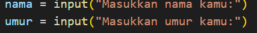
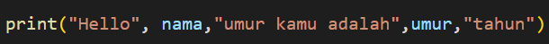
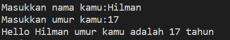
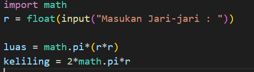
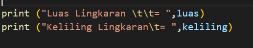

# Tugas Python

## Tutorial Membuat Program Python

### Membuat Program menghitung luas dan keliling lingkaran menggunakan python

1. Kita buat folder di pc kita  
2. Kita ketik Python.py 
3. Lalu kita masuk ke File python.py menggunakan ekstrak aplikasi masing masing, disini saya menggunakan Visual Studio Code 
4. Kita akan membuat Program untuk menginput Data Diri User  
  
5. Lalu langkah selanjutnya adalah membuat print atau untuk mencetak nanti di program python  
  
6. Contoh yang akan tampil di program seperti ini  
  
7. Langkah selanjutnya kita mulai membuat program mencari luas dan keliling lingkaran  
8. Kita buat flowchart nya seperti ini  
  
9. Dan kita buat program nya seperti ini
  
10. Lalu kita print programnya  
  
     

<i>sekian tutorial singkat ini saya ucapkan terima kasih, semoga bermanfaat</i>
